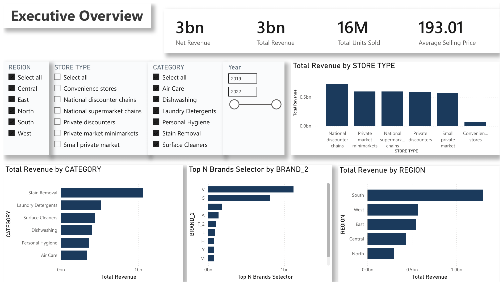
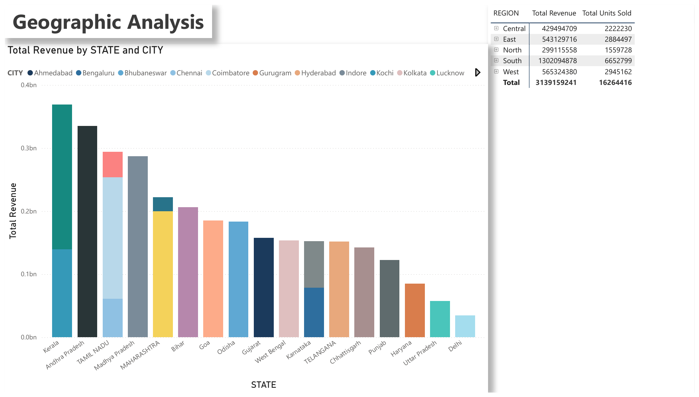
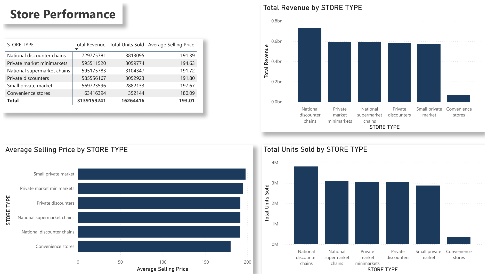
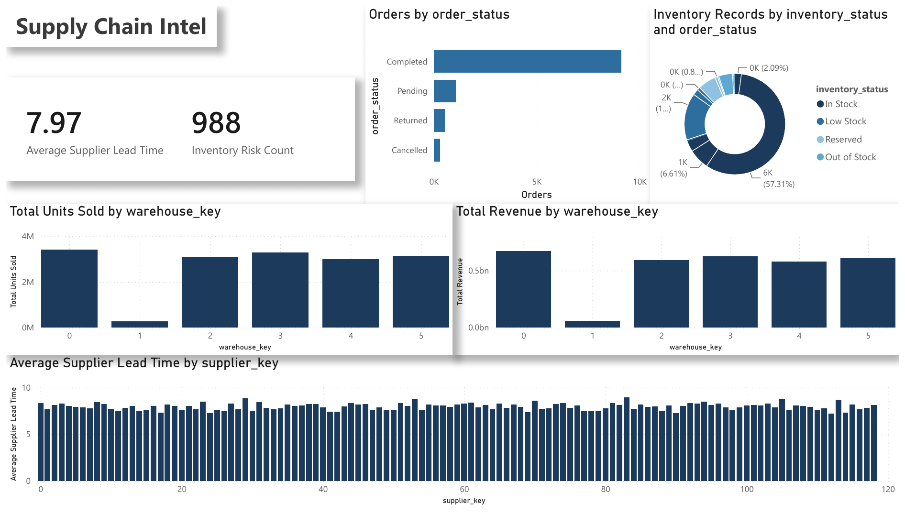

# Reckitt FMCG Sales Analytics Pipeline

A production-style data engineering pipeline that transforms raw FMCG retail sales data into a Power BI–ready star schema — built with PySpark, validated with automated tests, and designed to run reliably on Windows without a Hadoop/winutils dependency.

> **Portfolio project** built during a Data Engineering internship. Demonstrates ETL design, data quality validation, dimensional modeling, and production-grade Python/PySpark engineering practices.

---

## Business Problem

Reckitt's FMCG sales data is spread across geography, product, store, supplier, and inventory dimensions in a single flat export. Business users (sales managers, category managers, supply chain managers, regional heads, executives) need a centralized, trustworthy dataset to power a BI dashboard — without manually cleaning or reconciling raw exports every reporting cycle.

## Objectives

- Ingest raw monthly sales data with an explicit, versioned schema contract
- Validate data quality automatically and fail fast on critical issues
- Clean known data quality problems (dirty numeric placeholders, duplicate rows, missing warehouse IDs) without silently dropping valid records
- Model the data as a star schema optimized for Power BI (VertiPaq-friendly, one-to-many joins only)
- Produce a fully reproducible, tested pipeline suitable for a portfolio review

## Features

- Explicit PySpark schema (no `inferSchema` — see [technical_design.md](docs/technical_design.md))
- Automated data quality validation with configurable thresholds
- Robust cleaning: comma-formatted numbers, placeholder tokens (`-`, `NA`, `N/A`, `NULL`, blank, whitespace), exact-duplicate removal
- Feature engineering: calendar attributes, price-per-unit, category sales rank (window function), inventory risk flag
- Star schema with **guaranteed unique dimension natural keys** — dimensions are validated before every fact join, preventing row explosion
- Windows-safe CSV export (no Hadoop NativeIO / winutils dependency)
- Structured, professional execution log with per-stage timing
- 39 automated pytest tests covering ingestion, validation, cleaning, feature engineering, star schema, and full pipeline integration

## Architecture

```
Raw CSV → PySpark Ingestion → Validation → Cleaning → Feature Engineering
        → Star Schema Build (with uniqueness validation) → Curated CSV Export
        → Power BI Dashboard
```

See [docs/diagrams/system_architecture.md](docs/diagrams/system_architecture.md) for the full Mermaid diagram and [docs/architecture.md](docs/architecture.md) for the written design rationale.

## Technology Stack

| Layer | Technology |
|---|---|
| Processing | PySpark 3.5 |
| Language | Python 3.12 |
| Configuration | YAML |
| Testing | pytest |
| Visualization | Power BI |
| Source Control | Git |
| Development | VS Code |
| OS Target | Windows (Hadoop-free), portable to Linux/Mac |

## Project Structure

```
Reckitt-Dashboard/
├── config/
│   ├── config.yaml              # paths, thresholds, environment settings
│   └── schema_config.py         # explicit PySpark schema + column constants
├── src/
│   ├── ingestion/                data_loader.py
│   ├── validation/                data_quality.py
│   ├── transformation/            cleaning.py, feature_engineering.py
│   ├── modeling/                  star_schema_builder.py
│   └── utils/                     logger.py, spark_session.py, report.py
├── data/
│   ├── raw/                     # source CSV (not committed — see .gitignore)
│   ├── staging/
│   └── curated/                 # fact_sales.csv + 6 dim_*.csv
├── tests/                        pytest suite (39 tests)
├── docs/                          architecture, technical design, data dictionary, pipeline flow, deployment
│   └── diagrams/                  Mermaid architecture diagrams
├── main.py                       pipeline entrypoint/orchestrator
├── requirements.txt
├── requirements-dev.txt
└── pytest.ini
```

## ETL Workflow / Data Pipeline

1. **Ingestion** — reads the raw CSV with an explicit schema, normalizes column-name whitespace
2. **Validation** — computes null percentages, duplicate row counts, and flags columns exceeding a configurable null threshold
3. **Cleaning** — removes exact duplicates, converts placeholder tokens (`-`, `NA`, blank, etc.) to `NULL` before casting, imputes missing `WAREHOUSE_ID`
4. **Feature Engineering** — adds `Quarter`, `YearMonthKey`, `PricePerUnit`, `CategorySalesRank` (window function), `InventoryRiskFlag`
5. **Star Schema Build** — builds 6 dimension tables + 1 fact table; **validates every dimension has unique natural keys before any join**
6. **Export** — writes each curated table to a flat CSV (`data/curated/*.csv`) via pandas, avoiding the Windows Hadoop NativeIO dependency

Full detail: [docs/pipeline_flow.md](docs/pipeline_flow.md).

## Star Schema

```
fact_sales
 ├─→ dim_date
 ├─→ dim_geography
 ├─→ dim_store
 ├─→ dim_product
 ├─→ dim_supplier
 └─→ dim_warehouse
```

Grain: one `fact_sales` row = one product sold at one store in one month. Full field-level documentation: [docs/data_dictionary.md](docs/data_dictionary.md). Diagram: [docs/diagrams/star_schema.md](docs/diagrams/star_schema.md).

## Power BI Dashboard

The curated CSVs in `data/curated/` import directly into Power BI as a star schema (import mode), with single-direction, one-to-many relationships and `fact_sales` on the many side. The report file is [`powerbi/Reckitt_Executive_Analytics.pbix`](powerbi/Reckitt_Executive_Analytics.pbix) (PDF export: [`Reckitt_Executive_Analytics.pdf`](powerbi/Reckitt_Executive_Analytics.pdf)); DAX measures are documented in [`powerbi/dax_measures.md`](powerbi/dax_measures.md).

<p align="center">
  
</p>

<table>
  <tr>
    <td width="50%"><br /><sub><b>Geographic Analysis</b> · revenue by state and city</sub></td>
    <td width="50%"><br /><sub><b>Store Performance</b> · revenue, units and ASP by store type</sub></td>
  </tr>
  <tr>
    <td width="50%"><br /><sub><b>Supply Chain</b> · supplier lead time, inventory risk, order status</sub></td>
    <td width="50%"><br /><sub><b>Drill-through</b> · trend, return and cancellation rates for any selection</sub></td>
  </tr>
</table>

## How to Run

### Requirements

- Python 3.10+
- Java 11 or 17 (required by PySpark)
- ~500 MB free disk space

### Installation

```bash
git clone <https://github.com/uthrahh/Reckitt-Dashboard>
cd Reckitt-Dashboard
python -m venv .venv
.venv\Scripts\activate        # Windows
pip install -r requirements.txt
```

### Run the pipeline

```bash
python main.py
# or with a custom config:
python main.py --config config/config.yaml
```

Output: `data/curated/fact_sales.csv` + 6 `dim_*.csv` files, plus a full formatted execution log in the terminal.

### Run the tests

```bash
pip install -r requirements-dev.txt
pytest
```

See [docs/deployment.md](docs/deployment.md) for troubleshooting (including the Windows Hadoop NativeIO issue this project's export layer was specifically designed to avoid).

## Acknowledgements

- Built as part of a Data Engineering internship project.
