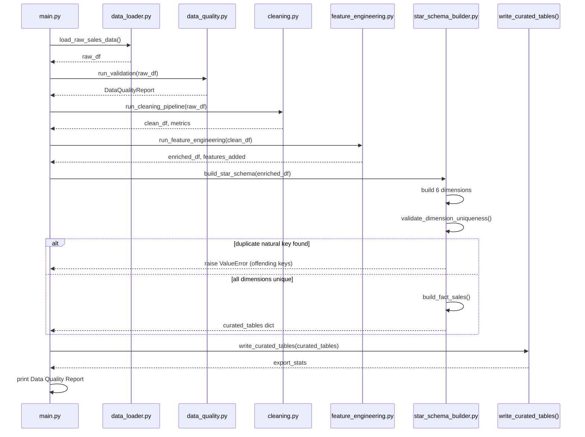

# ETL Pipeline Diagram

```mermaid
sequenceDiagram
    participant Main as main.py
    participant Ing as data_loader.py
    participant Val as data_quality.py
    participant Clean as cleaning.py
    participant Feat as feature_engineering.py
    participant Star as star_schema_builder.py
    participant Exp as write_curated_tables()

    Main->>Ing: load_raw_sales_data()
    Ing-->>Main: raw_df

    Main->>Val: run_validation(raw_df)
    Val-->>Main: DataQualityReport

    Main->>Clean: run_cleaning_pipeline(raw_df)
    Clean-->>Main: clean_df, metrics

    Main->>Feat: run_feature_engineering(clean_df)
    Feat-->>Main: enriched_df, features_added

    Main->>Star: build_star_schema(enriched_df)
    Star->>Star: build 6 dimensions
    Star->>Star: validate_dimension_uniqueness()
    alt duplicate natural key found
        Star-->>Main: raise ValueError (offending keys)
    else all dimensions unique
        Star->>Star: build_fact_sales()
        Star-->>Main: curated_tables dict
    end

    Main->>Exp: write_curated_tables(curated_tables)
    Exp-->>Main: export_stats

    Main->>Main: print Data Quality Report
```
