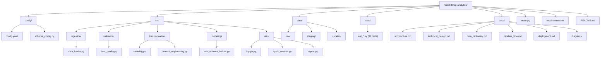

# Folder Structure Diagram

```mermaid
graph TD
    Root[reckitt-fmcg-analytics/]

    Root --> Config[config/]
    Config --> ConfigYaml[config.yaml]
    Config --> SchemaConfig[schema_config.py]

    Root --> Src[src/]
    Src --> Ingestion[ingestion/]
    Ingestion --> DataLoader[data_loader.py]

    Src --> Validation[validation/]
    Validation --> DataQuality[data_quality.py]

    Src --> Transformation[transformation/]
    Transformation --> Cleaning[cleaning.py]
    Transformation --> FeatureEng[feature_engineering.py]

    Src --> Modeling[modeling/]
    Modeling --> StarSchema[star_schema_builder.py]

    Src --> Utils[utils/]
    Utils --> Logger[logger.py]
    Utils --> SparkSession[spark_session.py]
    Utils --> Report[report.py]

    Root --> Data[data/]
    Data --> Raw[raw/]
    Data --> Staging[staging/]
    Data --> Curated[curated/]

    Root --> Tests[tests/]
    Tests --> TestFiles["test_*.py (39 tests)"]

    Root --> Docs[docs/]
    Docs --> Architecture[architecture.md]
    Docs --> TechDesign[technical_design.md]
    Docs --> DataDict[data_dictionary.md]
    Docs --> PipelineFlow[pipeline_flow.md]
    Docs --> Deployment[deployment.md]
    Docs --> Diagrams[diagrams/]

    Root --> MainPy[main.py]
    Root --> Requirements[requirements.txt]
    Root --> Readme[README.md]
```
