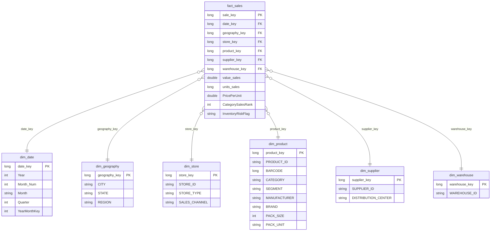

# Star Schema Diagram

```mermaid
erDiagram
    fact_sales }o--|| dim_date : date_key
    fact_sales }o--|| dim_geography : geography_key
    fact_sales }o--|| dim_store : store_key
    fact_sales }o--|| dim_product : product_key
    fact_sales }o--|| dim_supplier : supplier_key
    fact_sales }o--|| dim_warehouse : warehouse_key

    fact_sales {
        long sale_key PK
        long date_key FK
        long geography_key FK
        long store_key FK
        long product_key FK
        long supplier_key FK
        long warehouse_key FK
        double value_sales
        long units_sales
        double PricePerUnit
        int CategorySalesRank
        string InventoryRiskFlag
    }

    dim_date {
        long date_key PK
        int Year
        int Month_Num
        string Month
        int Quarter
        int YearMonthKey
    }

    dim_geography {
        long geography_key PK
        string CITY
        string STATE
        string REGION
    }

    dim_store {
        long store_key PK
        string STORE_ID
        string STORE_TYPE
        string SALES_CHANNEL
    }

    dim_product {
        long product_key PK
        string PRODUCT_ID
        long BARCODE
        string CATEGORY
        string SEGMENT
        string MANUFACTURER
        string BRAND
        int PACK_SIZE
        string PACK_UNIT
    }

    dim_supplier {
        long supplier_key PK
        string SUPPLIER_ID
        string DISTRIBUTION_CENTER
    }

    dim_warehouse {
        long warehouse_key PK
        string WAREHOUSE_ID
    }
```
