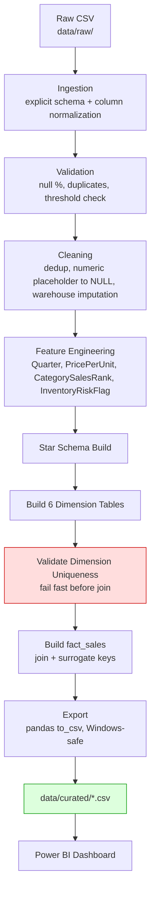

# System Architecture Diagram

```mermaid
flowchart TD
    A[Raw CSV<br/>data/raw/] --> B[Ingestion<br/>explicit schema + column normalization]
    B --> C[Validation<br/>null %, duplicates, threshold check]
    C --> D[Cleaning<br/>dedup, numeric placeholder to NULL, warehouse imputation]
    D --> E[Feature Engineering<br/>Quarter, PricePerUnit, CategorySalesRank, InventoryRiskFlag]
    E --> F[Star Schema Build]
    F --> F1[Build 6 Dimension Tables]
    F1 --> F2[Validate Dimension Uniqueness<br/>fail fast before join]
    F2 --> F3[Build fact_sales<br/>join + surrogate keys]
    F3 --> G[Export<br/>pandas to_csv, Windows-safe]
    G --> H[data/curated/*.csv]
    H --> I[Power BI Dashboard]

    style F2 fill:#ffdddd,stroke:#cc0000
    style H fill:#ddffdd,stroke:#009900
```
